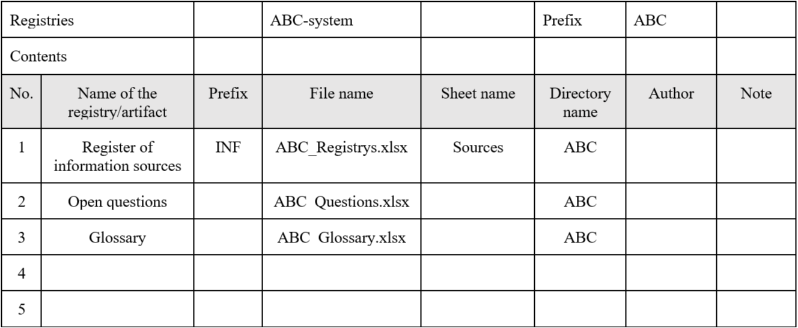

# IT analyst's role and functions in the IT systems development team 

Summary:
You will learn about a typical software development lifecycle, the typical team composition and the main functions of each individual at the lifecycle stages. You will also learn the concept of decomposition and the rules for its application.

---

>💡 If this is your very first project, fill out this [form](http://opros.so/kAnXy).

>💡 [Tap here](https://new.oprosso.net/p/4cb31ec3f47a4596bc758ea1861fb624) to leave your feedback on the project. It's anonymous and will help our team make your educational experience better. We recommend completing the survey immediately after the project.

## Contents

1. [Chapter I](#chapter-i) \
   1.1. [Preamble](#11)
2. [Chapter II](#chapter-ii) \
   2.1. [General Rules](#21)
3. [Chapter III](#chapter-iii) \
   3.1. [IT Systems Development Life Cycle](#31) \
   3.2. [Identifying Information Sources](#32) \
   3.3. [Glossary](#33) \
   3.4. [Placement, Naming and Other Rules](#34) \
   3.5. [Decomposition. Main Concepts](#35) \
   3.6. [Decomposition Rules](#36) \
   3.7. [Recommendations for Decomposition](#37)
4. [Chapter IV](#chapter-iv) \
   4.1. [Task 1. Haircut Appointment](#41) \
   4.2. [Task 2. Delivery of Orders](#42)
5. [Chapter V](#chapter-v) \
   5.1. [Exercise 00 — Creating a Workspace](#51) \
   5.2. [Exercise 01 — Identifying Information Sources](#52) \
   5.3. [Exercise 02 — Creating and Maintaining a Glossary](#53) \
   5.4. [Exercise 03 — Concept of Decomposition](#53) \
   5.5. [Exercise 04 — Types of Decomposition](#55) \
   5.6. [Exercise 05 — Types of Decomposition](#56) \
   5.7. [Exercise 06 — Decomposition Rules](#57)

## Chapter I 

### Preamble 

A typical software development life cycle consists of the following stages: research, design, development, testing, implementation, maintenance, and decommissioning. You will learn about the typical team composition and activities at each stage.

And in the current project, you'll also look at some of the skills of an IT analyst who performs some work at each stage of development:

1. Identifying sources of information.

The information initially specified in the terms of reference is usually insufficient. We must therefore be able to identify additional information quickly.

2. Consistency of terms and concepts.

Inaccuracies in the interpretation of terms and concepts can lead to project errors. The use of a project glossary can minimise the likelihood of inaccurate interpretation.

3. Decomposition.

One of the fundamental techniques of software design and development of complex IT systems.

In this project you will learn how to:

- Gather sources of information and use them in the future;
- Create and maintain a glossary for consistent interpretation of terms and concepts;
- "Break the elephant into pieces" by applying the principles and rules of decomposition.

### Literature

1. <https://cyberleninka.ru/article/n/printsipy-dekompozitsii-modeli-protsessa/viewer>
2. <https://docs.microsoft.com/ru-ru/dynamics365/project-operations/prod-pma/work-breakdown-structures>

## Chapter II 

### General Rules 

1. Along the way, you may feel a sense of uncertainty and a severe lack of information: that's OK. Remember, the information in the repository and on Google is always with you. So are your peers and Rocket.Chat. Communicate. Search. Use common sense. Don't be afraid to make mistakes.
2. Pay attention to sources of information. Check. Think. Analyse. Compare. 
3. Look at the text of each assignment. Read it several times. 
4. Read the examples carefully. There may be something in them that is not explicitly stated in the task itself.
5. You may find inconsistencies where something new in the terms of the task or examples conflicts with something you already know. If you come across such an inconsistency, try to work it out. If not, write it down as an open question and find out as you work. Do not leave open questions unanswered. 
6. If a task seems confusing or impossible, it only seems that way. Try to break it down. It is likely that some parts will become clear. 
7. There will be several tasks. Those marked with an asterisk (\*) are for the more meticulous students. These tasks are more difficult and are not compulsory. But doing them will give you extra experience and knowledge.
8. Don't try to fool the system or the people around you. You will fool yourself first.
9. Got a question? Ask your neighbour to the right. If that doesn't help, ask your neighbour on the left.
10. When you use help, you should always understand why and how. Otherwise the help is useless.
11. Always push only to the develop branch! The master branch will be ignored. Work in the src directory.
12. There should be no files in your directory other than those specified in the tasks.

## Chapter III 

### 1. IT Systems Development Life Cycle 

All software goes through 6 main stages, from the initial idea to its use by the end user. These stages may be called differently in different methodologies, but we will use the most commonly used terms. Here are these stages:

- Research (requirements gathering);
- Design;
- Development;
- Testing;
- Implementation;
- Maintenance.

Typically, the development team will have specialists with the following roles

- IT Analyst (may be a separate Business Analyst and Systems Analyst);
- Architect (they may have different orientations);
- Developer (these can also be different directions);
- Tester (these can also be different);
- Implementation/maintenance specialist;
- Manager;
- DevOps specialist;
- Technical Writer.

And these are just roles, not individual specialists. Each role can be performed by more than one person, and one person can perform more than one role.

### 2. Identifying Information Sources 

There are many ways to find information about a task — we'll talk about some of them later, but there is one method that everyone should know about and start with. This is a study of the materials we can find at the beginning: legal documents, official websites, articles in the mass media, descriptions of processes, popular science videos. In the case of state bodies — a list of functions assigned by the state (these can also be found on the official website).

We can't go through all the documents in a short time, so we need to create a list of information sources that can be used at any time.

Here we have:

1. Regulatory documents;
2. Orders, ordinances;
3. Websites, mass media articles, videos;
4. Rules, instructions;
5. Interviews, surveys;
6. World experience, best practices, competitors' experience;
7. etc.

To avoid getting lost in these sources, it is advisable to specify some parameters. You should choose them yourself, using common sense, for example to navigate quickly through a large number of documents:

1. Source (title, author, date of publication, where you found it, etc.);
2. URL;
3. Priority of the study; 
4. Relevance, legitimacy (is the information outdated? How trustworthy is the source?);
5. Date of introduction/closure (in the case of regulatory documents); 
6. Who is adding the source to the directory;
7. Date of entry;
8. A mark of study;
9. Note (content, comments, remarks)

Even a short note on the content and a small comment will help you to remember and refer back to the source when needed.

### 3. Glossary 

Often, different words are used to refer to the same concept, such as "stakeholders" and "interested parties". And sometimes the same name is used for completely different concepts, e.g. a personal account and a balance account may be shortened to just 'account'. Confusion in terms has a negative impact on the results of the analysis and subsequent design, increases the risk of errors, may require redesign of solutions already selected, and increases work time. To avoid this, you should create a glossary at the beginning of your work and maintain it throughout the project. It is important to understand that terms can change meaning, for example when regulatory documents change. Therefore, you should keep a history of changes to the glossary, indicating the date each concept was added/updated and recording its source.

### 4. Placement, Naming and Other Rules 

In order to reduce errors due to inconsistencies and unfortunate misunderstandings, it is recommended to follow the rules for placing and naming created artefacts. Usually these rules are created by the product/project team at the beginning. If you have joined the team in the course of the work — find out these rules and follow them. If there are no such rules, develop them yourself, share them with the team members and, if agreed, follow them. 

Below is a version of the rules that you can use when working on projects.

1. For each product (task), define a prefix — a three- or four-letter meaningful expression — and create a separate directory for each product (task) named with the prefix.
2. Place all work and project documents in the created directory. Often additional folders are created in the directory to separate documentation by type: contractual, work, project, user, etc. 
3. Save text documents consisting of lists in .xlsx format. This makes it easier to add new attributes and properties required for your work. You can also save them in .docx format in landscape orientation.
4. Place lists, directories on different sheets in an .xlsx file. 
5. When creating directoris, encode both the directory itself and its elements. One of the encoding options:
   - Each directory is denoted by a meaningful three-letter expression, e.g.:
     - STA — directory of interested parties (stakeholders);
     - INF — information source directory.
   - directory elements are indicated using the pattern <XXXYYYYYYYYYY>, where:
     - XXX — directory letter symbols;
     - YYYYY — numeric value, unique unchangeable number in the directory, number of characters is at the discretion of the directory developer.
6. Create Contents document, where you show all the artifacts created by the analysts, their location, author (responsible person). It is acceptable to place it as a separate sheet in the directory file.
7. Update Contents in the course of work.

P.S. Coding and placement principles may vary depending on system complexity, subject area, company or team rules.

#### Example: 

### 5. Decomposition. Main Concepts 

Decomposition, the process of breaking the whole into parts, allows us to look at any system as being made up of separate, interrelated subsystems, which in turn can be decomposed. We apply the decomposition process in IT wherever we break down our goals, tasks, and the functions and components of the IT system itself. Decomposition can be done in many ways, and there are many types of decomposition. Here are the types of decomposition commonly used in IT systems development:

1. **Functional** — structuring of functions. For example, in task 1 (Chapter IV), a barbershop client can perform actions (functions): 
   - Register on the website;
   - View master schedule;
   - Select a master, service or time;
   - Book a service.
2. **Object, component** — division into objects. Thus, Task 1 (Chapter IV) categorizes services into:
   - First level: type of service (hairdressing, cosmetic);
   - Second level (hairdressing): haircut, coloring, styling, etc.;
   - Second level (cosmetic): cleansing, massage, nourishing mask, etc.

**Decomposition goals** 

We choose the type of decomposition based on our goal. Table 1 shows the goals of decomposition and its main types, as well as the questions that help to perform the decomposition. 

Table 1. Questions to Identify Type of Decomposition

| Goal                                            | Decomposition Type | Questions                                                    |
| ----------------------------------------------- | ------------------ | ------------------------------------------------------------ |
| Identification of functions                     | Functional         | What does/should the system do? What does/should the system provide? |
| Identification of constituent parts (component) | Component, object  | What parts/subsystems/modules does/should the system consist of? |
| Structuring according to selected criteria      | Structural         | How is/should the system be divided according to the selected criteria? |
| Decomposition by time, by event                 | Temporal, event    | What stages does the system go through? How are the stages divided? |

**Level (Depth) of Decomposition**

The level of decomposition, i.e. the depth of breakdown and description detail, depends on the goal of the decomposition and the user (for whom it is intended). As an elementary level, a level is chosen which is sufficient for the work to be carried out. The desired system is taken as the zero level and is not taken into account when calculating the decomposition levels, as there is no partitioning at the zero level, as the system is represented as a whole at this level.

**Decomposition Documentation**

The decomposition can be written in the form of a diagram, a table or a directory.

Each element of the decomposition is assigned a unique identifier corresponding to the level and, for example, the sequence number at the level, using separators such as tabulators, punctuation marks, etc. Figure 1 shows the decomposition of a breakfast.

It is recommended to define 7 (+/- 2) subsystems/elements at each level. Of course, this is not always possible. Sometimes the number of elements is quite large. In such cases, the decomposition is presented in tabular or directory form.

Often the diagram shows not only the system to be decomposed, but also the higher level (supersystem), which includes the system in question, and adjacent systems — other subsystems of the supersystem. Figure 2 shows the decomposition of System 1. In addition, the same diagram shows the super-system and the adjacent system 2.

*Figure 1: Breakfast preparation decomposition*

*Figure 2: System 1 decomposition*

### 6. Decomposition Rules 

The following rules apply when making a decomposition:

1. Subordination;
2. Singularity of criterion;
3. Integrity.

**Subordination**

The decomposition usually starts from top to bottom. The initial system is located at the zero level and is represented in the form of parts of equal importance that do not overlap with each other and completely cover the upper level. This is the first level of decomposition. The breakdown of these subsystems leads to the appearance of subsystems of the second level, and so on.

**Singularity of criterion**

The system is decomposed according to only one criterion, which is constant for the level.The level criteria are chosen according to the objective of the decomposition. A decomposition criterion can be:

1. Purpose (performance of functions);
2. Structural arrangement (parts of the system, type of materials, surface shapes, etc.);
3. Structural attributes (ways of construction, etc.);
4. Types of stages and processes (life cycle, physical state, etc.);
5. Subject characteristics (economic, informational, technological, etc.);
6. etc.

For example, the decomposition of a car into the motor, chassis and body is carried out in accordance with the functional attribute (purpose). 

**Integrity**

Integrity is achieved through the following rules:

1. **Completeness:** The subsystems at one level should together fully characterise the system at the higher level. There should be nothing left that does not belong to one of the groups. If it is not possible to define a complete set of elements, it is allowed to enter the group "other", etc;
2. **Mutual non-intersection**: elements belonging to one group may not belong to another group at the same level.

P.S. Sometimes it is useful to break these rules, and we will look at such examples in future projects.

### 7. Recommendations for Decomposition 

Before carrying out the decomposition, define

1. Why should we decompose? What do we want to show?
2. Who are we decomposing for? What do they need?
3. Which indicator do we choose for the breakdown? What will be the components? 
4. What criteria will we use to separate subsystems and decomposition elements?

The answers to these questions will reveal the purpose and need for decomposition, and then you will determine the type of decomposition.

P.S. A good decomposition is not always successful at the first try (to be more precise — it is rarely successful at the first try). A good solution comes with experience.

**An example of how to create a decomposition using the Top-Bottom method**

1. Define the top (root, zero) level of decomposition — the system to be decomposed. 
2. Select several criteria (two to three) to separate the first level subsystems corresponding to the decomposition goal.
3. Break down the root system for each criterion.
4. Check that the decomposition rules are met for each criterion:
   - The top-level system is fully divided (no part left out);
   - All parts of the lower level are included in the upper level of the system; 
   - The parts of the lower level are divided according to a single criterion;
   - The parts do not overlap with each other.
5. Compare the results of the breakdown according to the selected criteria, choose the best one considering further actions.
6. Repeat steps 2-5 for each subsystem of the first level and all subsequent levels.
7. Stop at a level that is sufficient for those who will be working with the selected elements (functions, jobs, or objects).

## Chapter IV 

### Description of Tasks

### Task 1. Haircut Appointment 

The management of a chain of barbershops decided to implement an online booking system. The main objective is to develop the business by expanding the customer base through the possibility of online registration, as well as to reduce employee labour costs and manual labour by automatically informing customers through communication channels. 

Both registered and unregistered visitors can book an appointment on the website. When making an appointment, they can select the type of service: hairdressing or cosmetology, as well as the service itself, the master and the time from the available intervals. The system should provide automatic sending of reminders to clients through the communication channel chosen by the client (Telegram, WhatsApp, VK, sms) according to the schedule set by the manager. After receiving a service, the system offers the client to evaluate the service and write suggestions on how to improve the work.

The schedule of masters and the services provided by each master should be entered by the manager, who may be more than one person. This person is also responsible for keeping the schedule up to date and adjusting it if necessary, communicating with customers manually, marking the service, charging and accepting payment, sending the payment data to the accounting department. The manager can also receive reports on completed services and view customer feedback.

Each master has the ability to view the schedule and appointments for their services, as well as customer reviews.

### Task 2. Delivery of Orders 

During the lockdown, many grocery stores and food companies dramatically increased their online sales and the need for quick delivery of small quantities to individual customers increased. 

A group of students got together and decided to start a delivery service. The idea is to quickly receive information about orders, pickup location and time, delivery location, desired delivery dates, and distribute this information to couriers who will pick up the order at the pickup location and deliver it to the delivery location. They decided to develop an online system where orders could be collected and quickly sorted for delivery by couriers.

The first step was to collect orders from stores and caterers in any way possible and have the operator enter them into the system in a consistent format, as well as developing a mobile application for the courier. The courier should be able to view order information, select an order from those available, book it, pick it up at the collection point and deliver it to the customer. The result of the courier's actions should be immediately reflected in the system via a mobile application. The system should also include a dispatcher who controls the couriers and reassigns orders if necessary. Information on received orders should be sent to the accounting department (to another IT system) to calculate delivery charges with order suppliers. Order delivery information should also be sent to the accounting department to calculate payment to couriers. Accrued payment should be transferred to the system and displayed in the courier's personal account. And there should also be an administrator's workstation, where couriers are registered and access rights are assigned to all of them.

## Chapter V 

### Exercise 00 — Creating a Workspace 

**For each task**:

1. Determine the product prefix.
2. Create a separate directory in your GIT repository in the src subfolder, the directory name should contain the product prefix. 

### Exercise 01 — Identifying Information Sources 

**For each task:**

1. Create a directory of information sources.
2. Find at least 5 sources of information and place them into a directory.
3. Prioritize the study of sources of information.
4. Define the necessary directory parameters.
5. Indicate your answers in the turn-in file ex01\_<product prefix>\_infosources.xlsx. 

### Exercise 02 — Creating and Maintaining a Glossary 

**For each task:**

1. Create a glossary.
2. Place at least 10 concepts into the glossary.
3. Indicate your answers in the turn-in file ex02\_<product prefix>\_glossary.xlsx.

**Recommendations for tasks:**

1. (Hereafter) When you add new concepts to the glossary, you should enter the project number as the date the concept was added to the glossary (Example:BSA 00).

### Exercise 03 — Concept of Decomposition 

1. Find the demographic pyramid of the Russian Federation. Add the found pyramid to the file.
2. Specify the demographic pyramid breakdown indicator.
3. Indicate the purpose of the demographic pyramid.
4. Determine the type of decomposition of the demographic pyramid.
5. Specify:
   - How many levels of decomposition has has?
   - What are those levels?
   - What criteria are used to categorize each level?
6. Determine the order in which the demographic pyramid is constructed.
7. Indicate your answers in the turn-in file ex03\_decomposition.docx.

### Exercise 04 — Types of Decomposition 

**Breakfast menu:** boiled egg, buttered toast, juice, tea.

1. Look at the decomposition of breakfast in Figure 3:
   - Specify the goal and type of decomposition; 
   - Specify the number of decomposition levels;
   - Find decomposition errors and list them;
   - Correct errors in the decomposition and apply the corrected version to the next task.
2. Develop an object decomposition of breakfast based on the refined decomposition in the paragraph above:
   - Specify the goal of the decomposition;
   - Build a decomposition to level 2;
   - Specify the breakdown criteria for each level of the constructed decomposition.
3. Indicate your answers in the turn-in file ex04\_types.docx.

*Figure 3: Breakfast decomposition*

**Conditions:** 

The means of representing the decomposition is at your discretion.

### Exercise 05 — Types of Decomposition 

**For task 2:**

1. Study task 2 (Chapter IV).
2. Develop a decomposition of couriers' actions.
3. Determine the goal and type of decomposition. 
4. Specify the number of levels.
5. Develop an object decomposition of the actors (roles) of the task.
6. Specify the goal of object decomposition.
7. Specify the number of levels.
8. Indicate your answers in the turn-in file ex05\_types.docx.

### Exercise 06 — Decomposition Rules 

**Daily activities:**

1. List at least 10 activities of your day.
2. Define at least 2 decomposition goals; identify users and needs within each goal.
3. Build an event decomposition of your day's activities according to the chosen goal. Stick to the rules of decomposition.
4. Indicate your answers in the turn-in file ex06\_rules.docx.

**Recommendations for the task:**

There's no one right way to do a decomposition. You should always start with the goal, the needs of the user for whom you are creating the decomposition. Choose the type of decomposition based on this goal. Determine the activities based on the answers to the "Questions to Identify the Type of Decomposition". It is possible that the activities will be of different levels — at the stage of listing the activities this is normal. However, as you go on, it is important to look at the activities and rearrange them into levels according to the criteria.

Make sure that the elements at the same level are equivalent, answer the same question and are selected by the same criterion. They belong to that level, not to a higher or lower one. Make several choices and choose the one that best suits your goal, needs and circumstances.
